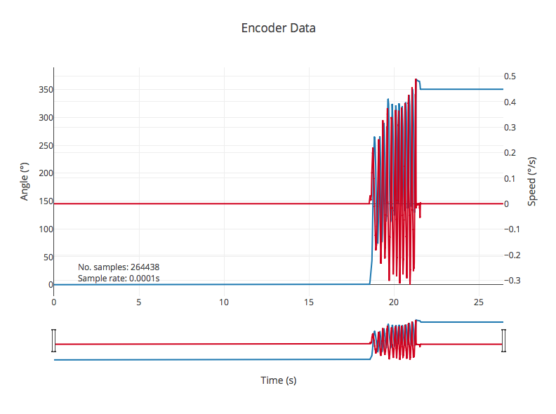

# Introduction
This project uses Beckhoff hardware to log an encoder position at 100µs intervals.
The encoder position is timestamped using the [EtherCAT distributed clock](https://infosys.beckhoff.com/english.php?content=../content/1033/ethercatsystem/2469118347.html&id=), and saved in a binary file format.
An iPython notebook is provided, using [pyads](http://pyads.readthedocs.io/en/latest/), 
[shutil](https://docs.python.org/3.6/library/shutil.html) and [struct](https://docs.python.org/3.6/library/struct.html) 
to load the file, and [matplotlib](https://matplotlib.org) or [plotly](https://plot.ly) to visualise the data.

## Features
The project demonstrates the following features:
- Timestamping of data using EtherCAT distributed clocks
- Writing files from the PLC
- Reading PLC variables over the network using ADS
- Converting data from the PLC into a Pythonic format
- Plotting data using common Python graphing tools

# Getting Started
## Prerequisites
1.  Installed and configured Beckhoff XAE
2.  Suitable hardware e.g. [Beckhoff CX-5130 Embedded PC](https://www.beckhoff.com/CX5130/), [Beckhoff EL-5101 encoder interface](https://www.beckhoff.com/EL5101/), Kübler 05.2400.1122.0360 incremental encoder

## Installation
1.	Download the code
2.  Add the PLC to your project in XAE
3.	Link the encoder counter to `MAIN.enc_raw`

## For iPython
1.  Install [Jupyter notebook](http://jupyter.readthedocs.io/en/latest/) (e.g. using Anaconda)
1.  Install [pyads](http://pyads.readthedocs.io/en/latest/), [matplotlib](https://matplotlib.org) and [plotly](https://plot.ly/python/getting-started/)
2.  Configure `BinaryPlotter.ipynbn` with your PLC's name and ADS address

# Documentation
For further documentation, see the [Wiki](https://jestfc.visualstudio.com/Encoder%20Logger/_wiki/wikis/docs)
