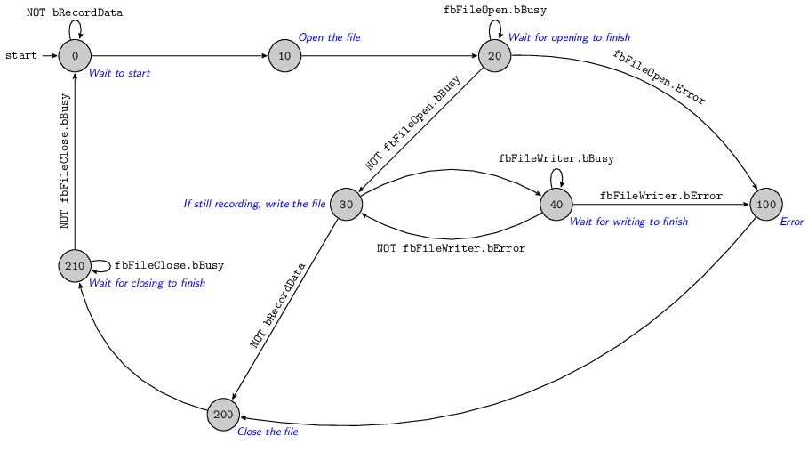

# PLC Code
The [main PLC code](./MAIN-PLC.md) fulfills three roles; reading the encoder data and timestamp, buffering of the data, and writing the buffer to file.

## Reading data
The encoder data is stored in `enc_raw` by the PLC, which reflects the internal counter on the EL5101. The encoder angle is calculated from this and stored in `enc_angle`.

Timestamping is achieved by reading the [EtherCAT distributed clock](https://infosys.beckhoff.com/english.php?content=../content/1033/ethercatsystem/2469118347.html&id=) at the start of the PLC scan, to `tDC`.

The encoder value `enc_raw` and timestamp `tDC` are stored in a `DCTIME64_UINT` [structure](https://jestfc.visualstudio.com/_git/Encoder%20Logger?path=/EncoderRead/EncoderLogger/DUTs/DCTIME64_UINT.TcDUT) which allows the time + data pairs to be manipulated simultaneous. 

## Buffering data
Each write takes approximately 1ms to complete; depending on the PLC scan rate, this limits the rate that data can be written to file.
In order to sample the data at the PLC task's scan frequency, it is necessary to buffer the data before writing. 
This is achieved by storing the current time-stamp and encoder value in an array, appending values at each PLC scan.

An array of `DCTIME64_UINT` [structures]($/EncoderRead/EncoderLogger/DUTs/DCTIME64_UINT.TcDUT) forms the buffer `stBuffer`.
On each PLC cycle, the next element in the array is written with the current timestamp + data pair. 
An integer count of the number of values currently in `stBuffer` is stored in `iEndOfBuffer`, to facilitate writing to the end of the buffer.

When the file writer is ready to process the next bathc of data, the buffer is copied to `stBufferToWrite` and cleared, resetting `iEndOfBuffer` to zero.

## Writing data
Writing data from the PLC roughly follows the [Beckhoff example code](https://infosys.beckhoff.com/english.php?content=../content/1033/tcplclib_tc2_system/18014398540571275.html&id=1203834407911917924).

The general process is as follows:
 -  Open the file with `FB_FileOpen`
 -  Wait for the file to be opened successfully
 -  Write some data to the file with `FB_FileWrite`
 -  Wait for writing to finish
 -  Write some more, as above
 -  Close the file with `FB_FileClose`
 -  Wait for the file to close successfully

The process is implemented in a state machine:

